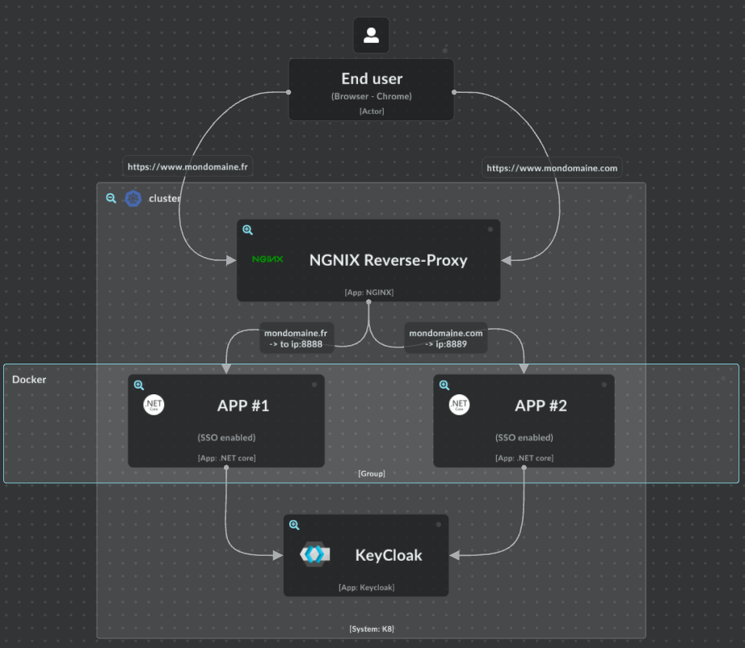
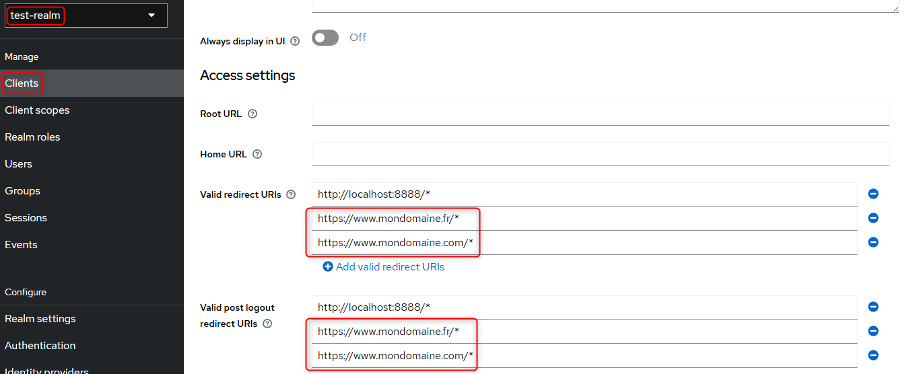

# 🔐 Blazor Server SSO Authentication with Keycloak – Proof of Concept

This project demonstrates a working **Single Sign-On (SSO)** implementation using **Keycloak** as the identity provider and **Blazor Server** as the front-end framework. It showcases how two domains (e.g., `mondomaine.fr` and `mondomaine.com`) can authenticate users via Keycloak and share authentication state.

---

## 🧰 Technologies

- **.NET 9.0 (Blazor Server)**
- **Keycloak (OpenID Connect)**
- **Nginx (reverse proxy with TLS support)**
- **Docker & Docker Compose**
- **mkcert (development SSL certificates)**


  

## 🔧 Step-by-Step Setup

### 🔐 Keycloak Configuration

1. Create a realm (e.g. `test-realm`)
2. Add client:
   - `Client ID`: `your-client-id`
   - `Access Type`: confidential
   - `Valid Redirect URIs`: `https://www.mondomaine.fr/signin-oidc`
   - `Base URL`: `https://www.mondomaine.fr/`
   - `Web Origins`: `+`

3. Set `Valid Post Logout Redirect URIs` to:  
   `https://www.mondomaine.fr/logout-success`


---

### 🧪 Program.cs – Authentication Configuration (Detailed)

```csharp
builder.Services.AddAuthentication(options =>
{
    options.DefaultScheme = CookieAuthenticationDefaults.AuthenticationScheme;
    options.DefaultChallengeScheme = OpenIdConnectDefaults.AuthenticationScheme;
})
.AddCookie(options =>
{
    options.Cookie.Name = "WebSsoAuthCookie";
    options.Cookie.HttpOnly = true;
    options.Cookie.SecurePolicy = CookieSecurePolicy.Always;
    options.ExpireTimeSpan = TimeSpan.FromDays(7);
    options.SlidingExpiration = true;
})
.AddOpenIdConnect(OpenIdConnectDefaults.AuthenticationScheme, options =>
{
    options.Authority = "https://auth.mondomaine.fr/realms/your-realm";
    options.ClientId = "your-client-id";
    options.ClientSecret = "your-secret";
    options.ResponseType = "code";

    options.SaveTokens = true;
    options.GetClaimsFromUserInfoEndpoint = true;
    options.CallbackPath = "/signin-oidc";
    options.SignedOutRedirectUri = "https://www.mondomaine.fr/logout-success";

    options.Scope.Add("openid");
    options.Scope.Add("profile");
    options.Scope.Add("email");

    options.Events = new OpenIdConnectEvents
    {
        OnRedirectToIdentityProviderForSignOut = async context =>
        {
            var idToken = await context.HttpContext.GetTokenAsync("id_token");
            var logoutUri = $"{context.Options.Authority}/protocol/openid-connect/logout" +
                            $"?id_token_hint={idToken}" +
                            $"&post_logout_redirect_uri={Uri.EscapeDataString(context.Options.SignedOutRedirectUri)}";

            context.Response.Redirect(logoutUri);
            context.HandleResponse();
        },
        OnSignedOutCallbackRedirect = context =>
        {
            context.Response.Redirect("/logout-success");
            context.HandleResponse();
            return Task.CompletedTask;
        }
    };
});
```

This configuration enables:
- Token persistence in cookies
- OIDC-based login/logout flows
- Secure redirect URIs

---

### 🚀 Docker Compose

This Docker Compose allows the same application to run on two different ports. The Nginx reverse proxy will handle redirecting www.mondomaine.fr to IP:8888 and www.mondomaine.com to IP:8889, respectively.

```yaml
services:
  mondomaine-fr:
    image: ${DOCKER_REGISTRY-}websso
    environment:
    - ASPNETCORE_ENVIRONMENT=Development
    - ASPNETCORE_URLS=http://+:8080
    - signout-callback=https://www.mondomaine.fr/signout-callback-oidc
    - base-uri=https://www.mondomaine.fr
    build:
      context: .
      dockerfile: WebSso/Dockerfile
    ports:
      - "8888:8080"
  mondomaine-com:
    image: ${DOCKER_REGISTRY-}websso
    environment:
    - ASPNETCORE_ENVIRONMENT=Development
    - ASPNETCORE_URLS=http://+:8080
    - signout-callback=https://www.mondomaine.com/signout-callback-oidc
    - base-uri=https://www.mondomaine.com
    build:
      context: .
      dockerfile: WebSso/Dockerfile
    ports:
      - "8889:8080"
```

Use:

```bash
docker compose up --build
```
### ✅ Generate Development Certificates

Using [mkcert](https://github.com/FiloSottile/mkcert), generate trusted local certificates:

```bash
choco install mkcert
```

```bash
mkcert -install
mkcert -cert-file mondomaine.fr.pem -key-file mondomaine.fr-key.pem mondomaine.fr www.mondomaine.fr
mkcert -cert-file mondomaine.com.pem -key-file mondomaine.com-key.pem mondomaine.com www.mondomaine.com
```
The command mkcert -install is used to set up a local Certificate Authority (CA) on your development machine

Move the `.pem` files into `/etc/nginx/certs`.

---
### 🛠️ Install Nginx on ubuntu

```bash
sudo apt update
sudo apt upgrade -y
sudo apt install nginx -y
```

Start NGINX
```bash
sudo systemctl start nginx
sudo systemctl enable nginx
```

---
### 🛠️ Configure Nginx as Reverse Proxy

Example `nginx.conf` for HTTPS forwarding:

```nginx
server {
    listen 443 ssl;
    server_name www.mondomaine.fr mondomaine.fr;

    ssl_certificate     /etc/nginx/certs/mondomaine.fr.pem;
    ssl_certificate_key /etc/nginx/certs/mondomaine.fr-key.pem;

    # Configuration for signin with oidc / KeyCloak
    proxy_busy_buffers_size   512k;
    proxy_buffers   4 512k;
    proxy_buffer_size   256k;
    large_client_header_buffers 4 32k;

    location / {
        proxy_pass http://192.168.1.53:8888;
        proxy_ssl_verify off; 
        proxy_set_header Upgrade $http_upgrade;
        proxy_set_header Connection "Upgrade";
        proxy_set_header Host $host;
        proxy_set_header X-Real-IP $remote_addr;
        proxy_set_header X-Forwarded-For $proxy_add_x_forwarded_for;
        proxy_set_header X-Forwarded-Proto $scheme;

        proxy_cookie_path / "/; HttpOnly; Secure; SameSite=None";
    }
}

server {
    listen 80;
    server_name mondomaine.fr www.mondomaine.fr;
    return 301 https://$host$request_uri;
}
```
192.168.1.53 must be replaced by : 
 - the IP address of the machine hosting Docker; the Docker configuration is detailed further below. Or
 - From the URL that the proxy must redirect

```bash
sudo ln -s /etc/nginx/sites-available/mondomaine.com /etc/nginx/sites-enable
sudo systemctl restart nginx
```

Ensure port `443` is open and reachable.

## 🧪 Test the POC

- Open [https://www.mondomaine.fr](https://www.mondomaine.fr)
- You will be redirected to Keycloak for authentication
- Upon successful login, you're returned and logged into the app
- Switch to https://www.mondomaine.com, your are logged in
- Try logging out and ensure you're redirected via Keycloak logout
- Both app are signed out

---

## 📌 Notes

- Chrome may block `http://localhost:<port>` for cookies, use HTTPS + trusted cert
- If behind a proxy, ensure `X-Forwarded-*` headers are passed and `ForwardedHeaders` middleware is used
- Use the browser dev tools → Application → Cookies to debug authentication state

---

## 🧾 License

MIT

---

## 📬 Contact

For support or collaboration, open an issue or contact the maintainer.
